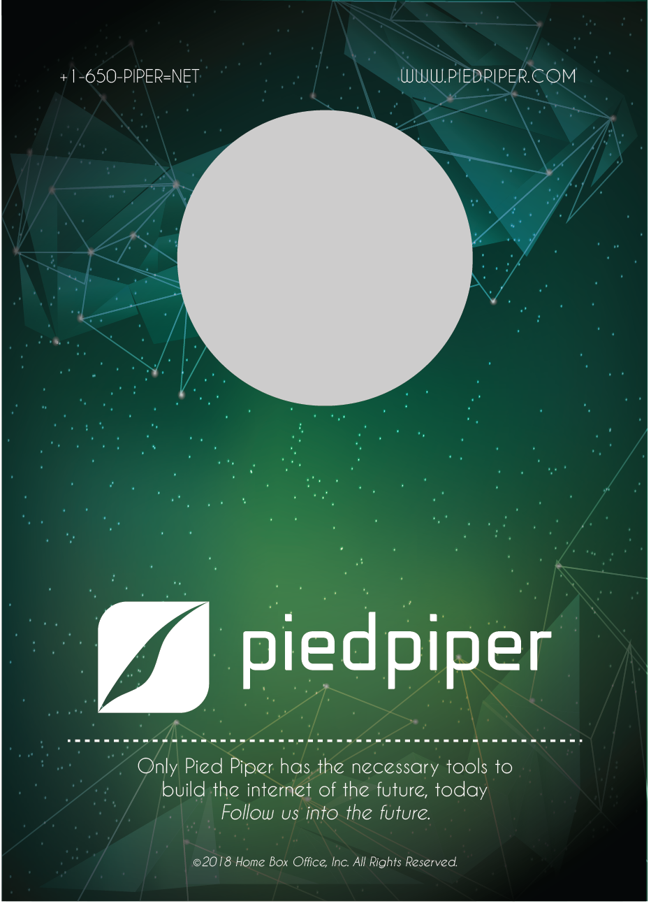
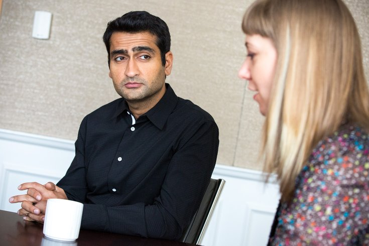

# Silicard
OpenCV face detection w/dnn based profile card generator.
## Before


## Sample Photos
  

## After
  

### __File naming convention:__
The script assumes that the image files are named in the following manner
```
firstname_lastname-designation_title.ext
```
Example:
```
Jared_dunn-chief_operating_officer.jpg
```
___Note__: The name of the file is case insensitive as I have taken care of it in the script.
Supported file formats are png, jpg & jpeg._

### __Usage:__
```
python generate_profiles.py -i some_directory\firstname_lastnames-designation.png
```
or
```
python generate_profiles.py --all
```
This will run the script for all the files in the same directory as the script.

___Disclaimer__: I do not own any of the images, theses are downloaded via a search through google images.
Pied Piper logo and the name are owned by HBO._

_Script reference credits : [PyImageSearch](https://www.pyimagesearch.com/2018/02/26/face-detection-with-opencv-and-deep-learning/)_

_Card tempelate & background credit : [Designed by Freepik](http://www.freepik.com)_
